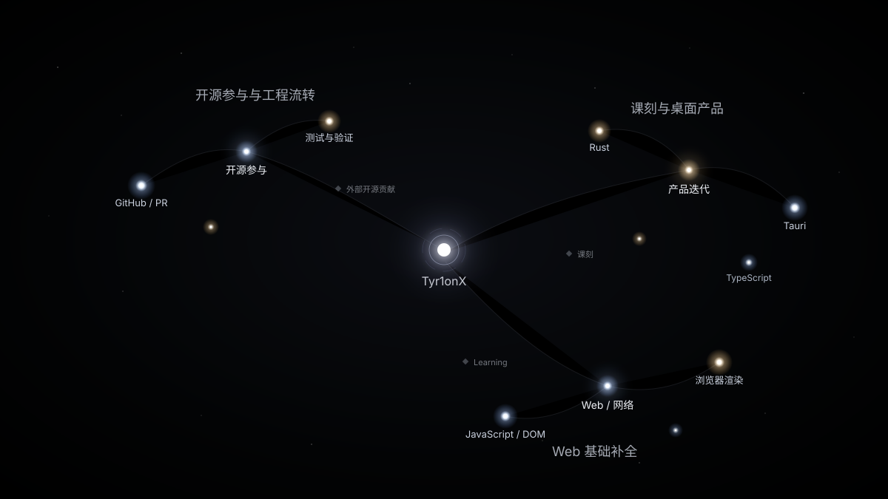

# Knowledge Constellation

[中文版](README.md)

> Give Codex material about you, and let it turn that material into your own knowledge universe.

Knowledge Constellation is a **Codex Skill**.

Instead of asking you to list your skills or assign yourself scores, it reads the real traces you leave behind — what you built, learned, explored, and worked through — and turns them into a personal knowledge constellation.

## Use it

1. Install [`SKILL.md`](SKILL.md) from this repository.
2. Give Codex material about you: GitHub activity, projects, a resume, learning notes, pull requests, notes, or anything else that helps describe your work and learning.
3. Tell Codex: **“Use Knowledge Constellation to generate my knowledge map.”**

Codex handles the rest.

You do not need to manually build a tech stack, score your abilities, prepare JSON, or run the generation pipeline yourself.

## What you get

- **Stars** represent knowledge and experience.
- **Galaxies** naturally group related areas.
- **Project anchors** show where that knowledge came from.
- **Zooming in** gradually reveals finer details and relationships.

Your constellation can keep growing as you provide new material.

> The preview is based on the repository's existing Tyr1onX sample and the current Renderer visual baseline.
